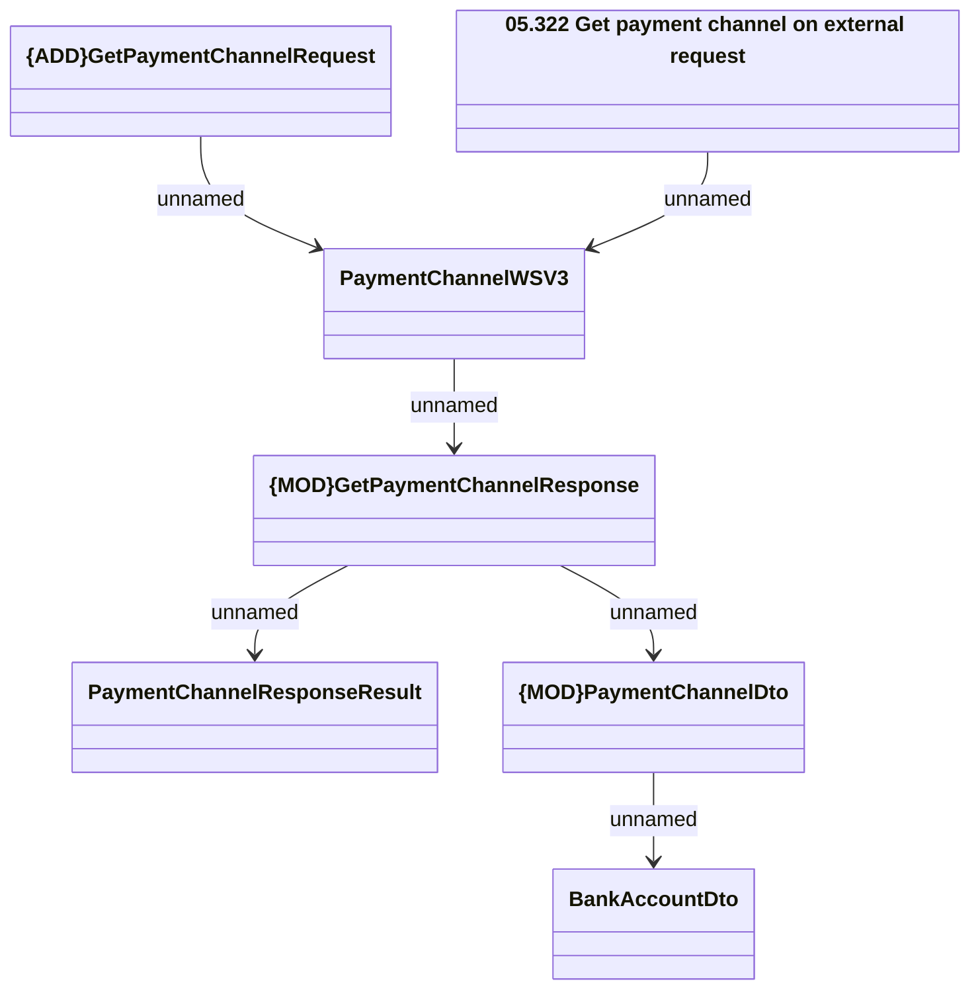

# PaymentChannelWSV3 - Get Payment Channel

```mermaid
classDiagram
    class PaymentChannelResponseResult["PaymentChannelResponseResult"]
    class BankAccountDto["BankAccountDto"]
    class MOD_PaymentChannelDto["{MOD}PaymentChannelDto"]
    class MOD_GetPaymentChannelResponse["{MOD}GetPaymentChannelResponse"]
    class n_05_322_Get_payment_channel_on_external_request["05.322 Get payment channel on external request"]
    class ADD_GetPaymentChannelRequest["{ADD}GetPaymentChannelRequest"]
    class PaymentChannelWSV3["PaymentChannelWSV3"]
    PaymentChannelWSV3 --> MOD_GetPaymentChannelResponse : unnamed
    ADD_GetPaymentChannelRequest --> PaymentChannelWSV3 : unnamed
    MOD_GetPaymentChannelResponse --> MOD_PaymentChannelDto : unnamed
    MOD_GetPaymentChannelResponse --> PaymentChannelResponseResult : unnamed
    n_05_322_Get_payment_channel_on_external_request --> PaymentChannelWSV3 : unnamed
    MOD_PaymentChannelDto --> BankAccountDto : unnamed
```
