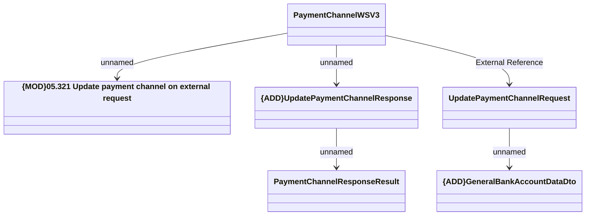

# PaymentChannelWSV3 - Update Payment Channel

```mermaid
classDiagram
    class ADD_GeneralBankAccountDataDto["{ADD}GeneralBankAccountDataDto"]
    class MOD_05_321_Update_payment_channel_on_external_request["{MOD}05.321 Update payment channel on external request"]
    class UpdatePaymentChannelRequest["UpdatePaymentChannelRequest"]
    class PaymentChannelResponseResult["PaymentChannelResponseResult"]
    class ADD_UpdatePaymentChannelResponse["{ADD}UpdatePaymentChannelResponse"]
    class PaymentChannelWSV3["PaymentChannelWSV3"]
    PaymentChannelWSV3 --> ADD_UpdatePaymentChannelResponse : unnamed
    PaymentChannelWSV3 --> MOD_05_321_Update_payment_channel_on_external_request : unnamed
    PaymentChannelWSV3 --> UpdatePaymentChannelRequest : External Reference
    ADD_UpdatePaymentChannelResponse --> PaymentChannelResponseResult : unnamed
    UpdatePaymentChannelRequest --> ADD_GeneralBankAccountDataDto : unnamed
```
