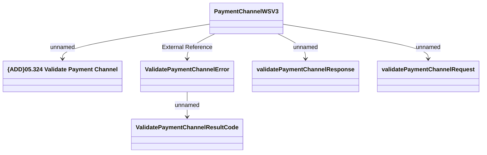

# PaymentChannelWSV3 - Validate Payment Channel

```mermaid
classDiagram
    class ADD_05_324_Validate_Payment_Channel["{ADD}05.324 Validate Payment Channel "]
    class ValidatePaymentChannelResultCode["ValidatePaymentChannelResultCode"]
    class ValidatePaymentChannelError["ValidatePaymentChannelError"]
    class validatePaymentChannelResponse["validatePaymentChannelResponse"]
    class validatePaymentChannelRequest["validatePaymentChannelRequest"]
    class PaymentChannelWSV3["PaymentChannelWSV3"]
    PaymentChannelWSV3 --> ADD_05_324_Validate_Payment_Channel : unnamed
    PaymentChannelWSV3 --> validatePaymentChannelResponse : unnamed
    PaymentChannelWSV3 --> validatePaymentChannelRequest : unnamed
    PaymentChannelWSV3 --> ValidatePaymentChannelError : External Reference
    ValidatePaymentChannelError --> ValidatePaymentChannelResultCode : unnamed
```
