# PaymentChannelWSV3

- **Diagram Type**: Logical
- **Package**: HomerSelect/BSL/Analysis Model/_Interface/Provided Web Services/Payments/PaymentChannelWS/PaymentChannelWSV3
- **Diagram ID**: 127861
- **Elements**: 7
- **Connectors**: 0

```mermaid
classDiagram
    class PaymentChannelWSV3_PaymentChannelWSV3_Validate_Payment_Chann["PaymentChannelWSV3 : PaymentChannelWSV3 - Validate Payment Channel"]
    class PaymentChannelWSV3_PaymentChannelWSV3_Update_Payment_Channel["PaymentChannelWSV3 : PaymentChannelWSV3 - Update Payment Channel"]
    class PaymentChannelWSV3_PaymentChannelWSV3_Get_Payment_Channel_By["PaymentChannelWSV3 : PaymentChannelWSV3 - Get Payment Channel By Bank Account"]
    class PaymentChannelWSV3_PaymentChannelWSV3_Create_Payment_Channel["PaymentChannelWSV3 : PaymentChannelWSV3 - Create Payment Channel"]
    class PaymentChannelWSV3_PaymentChannelWSV3_Change_Repayment_Chann["PaymentChannelWSV3 : PaymentChannelWSV3 - Change Repayment Channel"]
    class PaymentChannelWSV3["PaymentChannelWSV3"]
    class PaymentChannelWSV3_PaymentChannelWSV3_Get_Payment_Channel["PaymentChannelWSV3 : PaymentChannelWSV3 - Get Payment Channel"]
```

