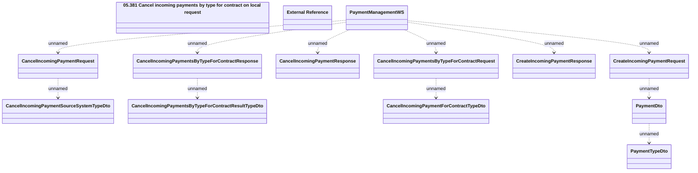

# PaymentManagementWS

- **Diagram Type**: Logical
- **Package**: HomerSelect/BSL/Analysis Model/_Interface/Provided Web Services/Payments/PaymentManagementWS
- **Diagram ID**: 117263
- **Elements**: 15
- **Connectors**: 11

