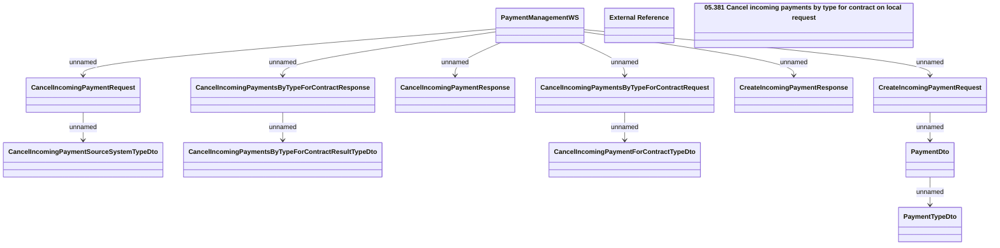

# PaymentManagementWS

```mermaid
classDiagram
    class CancelIncomingPaymentSourceSystemTypeDto["CancelIncomingPaymentSourceSystemTypeDto"]
    class CancelIncomingPaymentsByTypeForContractResultTypeDto["CancelIncomingPaymentsByTypeForContractResultTypeDto"]
    class CancelIncomingPaymentForContractTypeDto["CancelIncomingPaymentForContractTypeDto"]
    class CancelIncomingPaymentsByTypeForContractResponse["CancelIncomingPaymentsByTypeForContractResponse"]
    class CancelIncomingPaymentsByTypeForContractRequest["CancelIncomingPaymentsByTypeForContractRequest"]
    class PaymentDto["PaymentDto"]
    class PaymentTypeDto["PaymentTypeDto"]
    class CancelIncomingPaymentResponse["CancelIncomingPaymentResponse"]
    class CancelIncomingPaymentRequest["CancelIncomingPaymentRequest"]
    class CreateIncomingPaymentResponse["CreateIncomingPaymentResponse"]
    class CreateIncomingPaymentRequest["CreateIncomingPaymentRequest"]
    class PaymentManagementWS["PaymentManagementWS"]
    class External_Reference["External Reference"]
    class External_Reference["External Reference"]
    class n_05_381_Cancel_incoming_payments_by_type_for_contract_on_lo["05.381 Cancel incoming payments by type for contract on local request"]
    PaymentDto --> PaymentTypeDto : unnamed
    PaymentManagementWS --> CreateIncomingPaymentResponse : unnamed
    PaymentManagementWS --> CancelIncomingPaymentsByTypeForContractRequest : unnamed
    PaymentManagementWS --> CreateIncomingPaymentRequest : unnamed
    PaymentManagementWS --> CancelIncomingPaymentsByTypeForContractResponse : unnamed
    PaymentManagementWS --> CancelIncomingPaymentResponse : unnamed
    PaymentManagementWS --> CancelIncomingPaymentRequest : unnamed
    CreateIncomingPaymentRequest --> PaymentDto : unnamed
    CancelIncomingPaymentsByTypeForContractResponse --> CancelIncomingPaymentsByTypeForContractResultTypeDto : unnamed
    CancelIncomingPaymentsByTypeForContractRequest --> CancelIncomingPaymentForContractTypeDto : unnamed
    CancelIncomingPaymentRequest --> CancelIncomingPaymentSourceSystemTypeDto : unnamed
```
