# PaymentsWS

- **Diagram Type**: Logical
- **Package**: HomerSelect/BSL/Analysis Model/_Interface/Provided Web Services/Payments/PaymentsWS
- **Diagram ID**: 94071
- **Elements**: 18
- **Connectors**: 10

```mermaid
classDiagram
    class n_05_012_Automatic_import_incoming_payments["05.012 Automatic import incoming payments"]
    class hsIncomingPaymentsFile["hsIncomingPaymentsFile"]
    class CreatePayment_CreatePayment["CreatePayment : CreatePayment"]
    class CancelPayment_CancelPayment["CancelPayment : CancelPayment"]
    class TRS_WUS["TRS (WUS)"]
    class DDS_Import_DDS_Import["DDS_Import : DDS_Import"]
    class DDS_Confirmation_DDS_Confirmation["DDS_Confirmation : DDS_Confirmation"]
    class IncomingDirectDebitMandates_IncomingDirectDebitMandates["IncomingDirectDebitMandates : IncomingDirectDebitMandates"]
    class diagram_E3355054_183E_4a88_9259_476C20C0F914["$diagram://{E3355054-183E-4a88-9259-476C20C0F914}"]
    class hsIncomingDirectDebitMandateFile["hsIncomingDirectDebitMandateFile"]
    class hsDirectDebitStatementsFile["hsDirectDebitStatementsFile"]
    class hsDirectDebitStatementsFile["hsDirectDebitStatementsFile"]
    class diagram_25243EA4_D216_40ea_971E_1361116F184F["$diagram://{25243EA4-D216-40ea-971E-1361116F184F}"]
    class n_05_261_Automatic_Import_DD_confirmations["05.261 Automatic Import DD confirmations"]
    class n_05_251_Automatic_Import_DD_statements["05.251 Automatic Import DD statements"]
    class n_01_585_Automatic_import_DDM_confirmation_result["01.585 Automatic import DDM confirmation result"]
    class PaymentsWS["PaymentsWS"]
    class BSL["BSL"]
    PaymentsWS ..> n_01_585_Automatic_import_DDM_confirmation_result : unnamed
    PaymentsWS ..> n_05_251_Automatic_Import_DD_statements : unnamed
    PaymentsWS ..> n_05_261_Automatic_Import_DD_confirmations : unnamed
    PaymentsWS ..> hsDirectDebitStatementsFile : unnamed
    PaymentsWS ..> hsDirectDebitStatementsFile : unnamed
    PaymentsWS ..> hsIncomingDirectDebitMandateFile : unnamed
    TRS_WUS --> n_05_251_Automatic_Import_DD_statements : unnamed
    TRS_WUS --> n_01_585_Automatic_import_DDM_confirmation_result : unnamed
    TRS_WUS --> n_05_261_Automatic_Import_DD_confirmations : unnamed
    TRS_WUS --> n_05_012_Automatic_import_incoming_payments : unnamed
```

