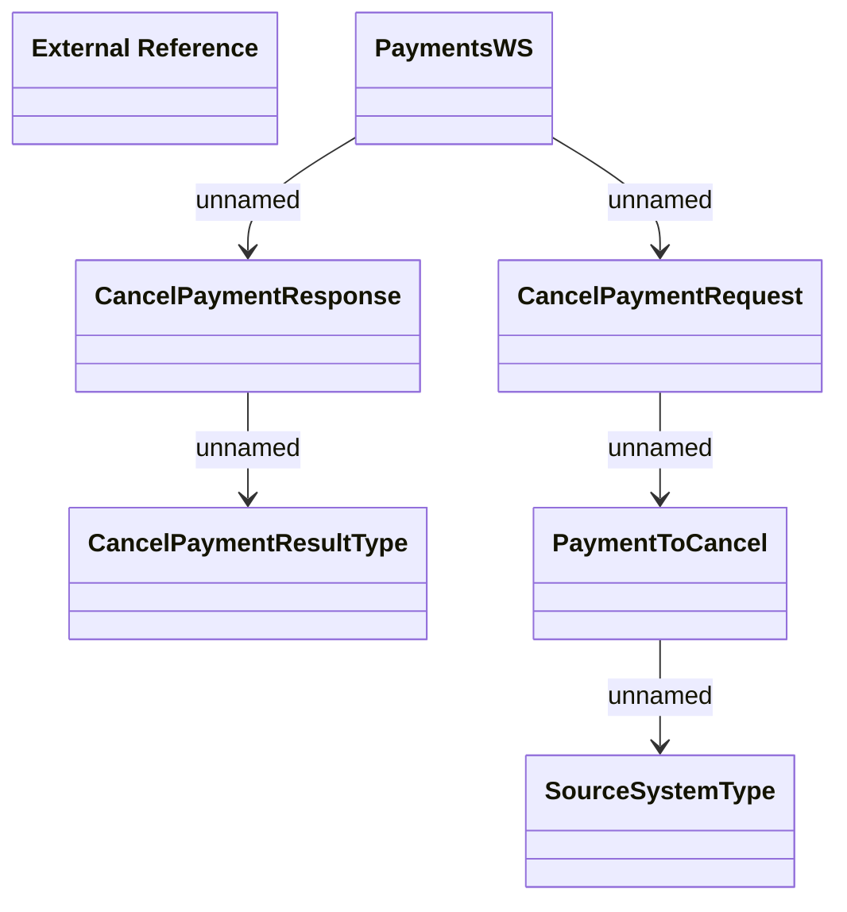

# CancelPayment

- **Diagram Type**: Logical
- **Package**: HomerSelect/BSL/Analysis Model/_Interface/Provided Web Services/Payments/PaymentsWS/CancelPayment
- **Diagram ID**: 83233
- **Elements**: 7
- **Connectors**: 5

