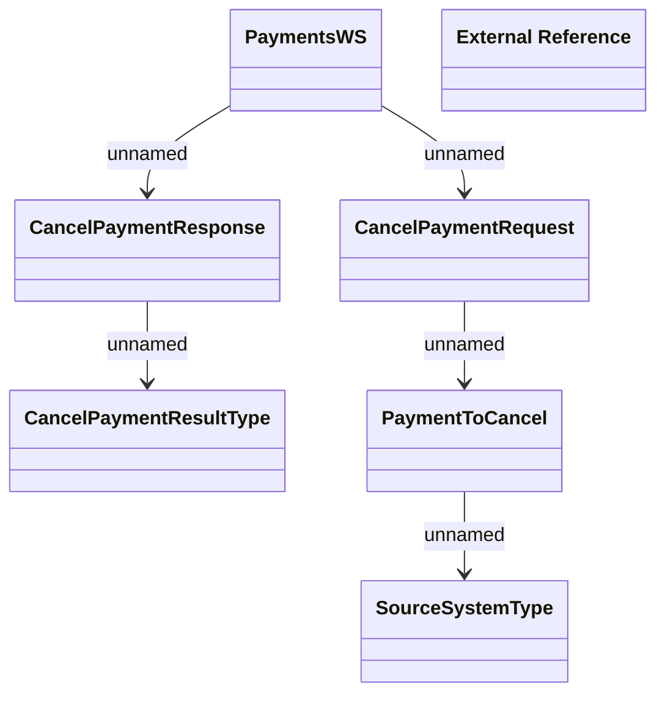

# CancelPayment

```mermaid
classDiagram
    class SourceSystemType["SourceSystemType"]
    class CancelPaymentResultType["CancelPaymentResultType"]
    class CancelPaymentResponse["CancelPaymentResponse"]
    class PaymentToCancel["PaymentToCancel"]
    class CancelPaymentRequest["CancelPaymentRequest"]
    class PaymentsWS["PaymentsWS"]
    class External_Reference["External Reference"]
    CancelPaymentRequest --> PaymentToCancel : unnamed
    PaymentToCancel --> SourceSystemType : unnamed
    CancelPaymentResponse --> CancelPaymentResultType : unnamed
    PaymentsWS --> CancelPaymentRequest : unnamed
    PaymentsWS --> CancelPaymentResponse : unnamed
```
