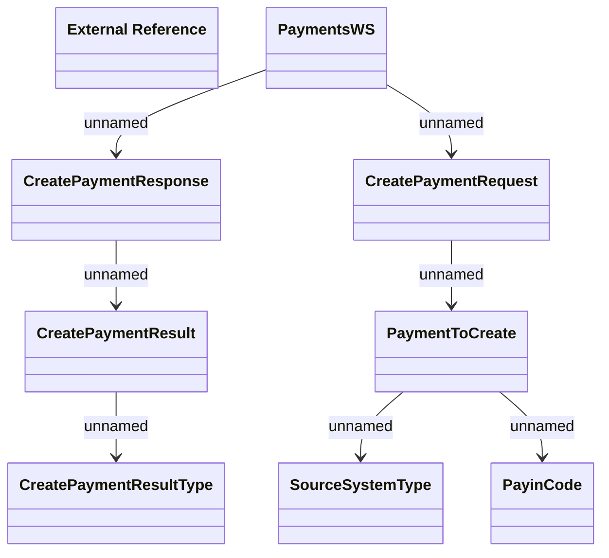

# PaymentsWS.CreatePayment

- **Diagram Type**: Logical
- **Package**: HomerSelect/BSL/Analysis Model/_Interface/Provided Web Services/Payments/PaymentsWS/CreatePayment
- **Diagram ID**: 97714
- **Elements**: 9
- **Connectors**: 7

