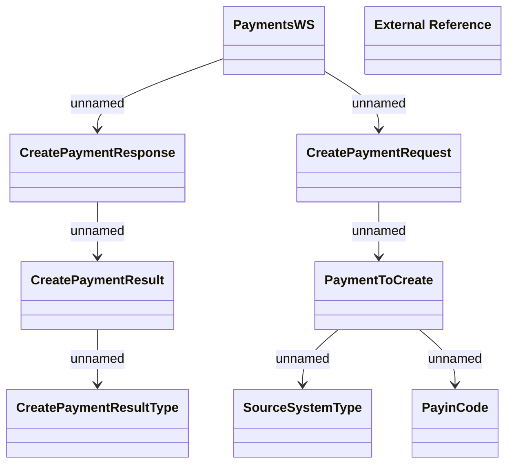

# PaymentsWS.CreatePayment

```mermaid
classDiagram
    class CreatePaymentResultType["CreatePaymentResultType"]
    class PayinCode["PayinCode"]
    class SourceSystemType["SourceSystemType"]
    class CreatePaymentResult["CreatePaymentResult"]
    class PaymentToCreate["PaymentToCreate"]
    class CreatePaymentResponse["CreatePaymentResponse"]
    class CreatePaymentRequest["CreatePaymentRequest"]
    class PaymentsWS["PaymentsWS"]
    class External_Reference["External Reference"]
    PaymentsWS --> CreatePaymentResponse : unnamed
    PaymentsWS --> CreatePaymentRequest : unnamed
    CreatePaymentRequest --> PaymentToCreate : unnamed
    CreatePaymentResponse --> CreatePaymentResult : unnamed
    PaymentToCreate --> SourceSystemType : unnamed
    PaymentToCreate --> PayinCode : unnamed
    CreatePaymentResult --> CreatePaymentResultType : unnamed
```
