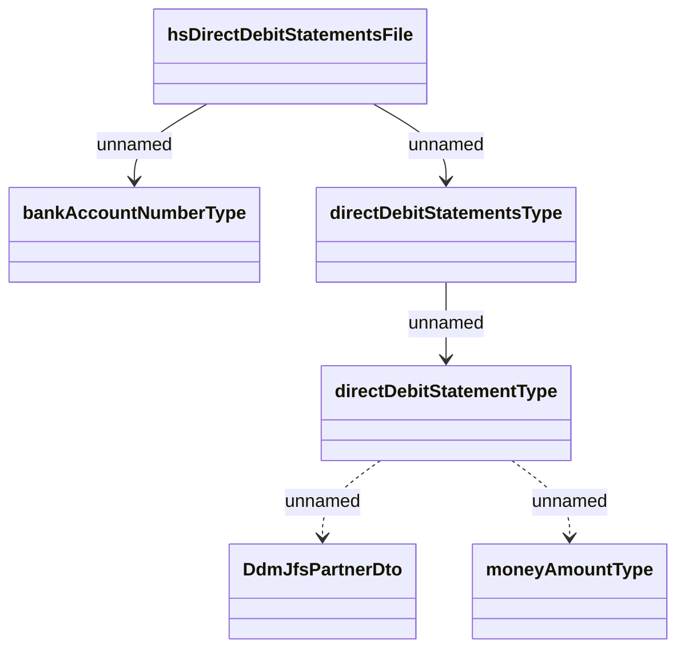

# DDS_Confirmation

- **Diagram Type**: Logical
- **Package**: HomerSelect/BSL/Analysis Model/_Interface/Provided Web Services/Payments/PaymentsWS/DDS_Confirmation
- **Diagram ID**: 109307
- **Elements**: 6
- **Connectors**: 5

