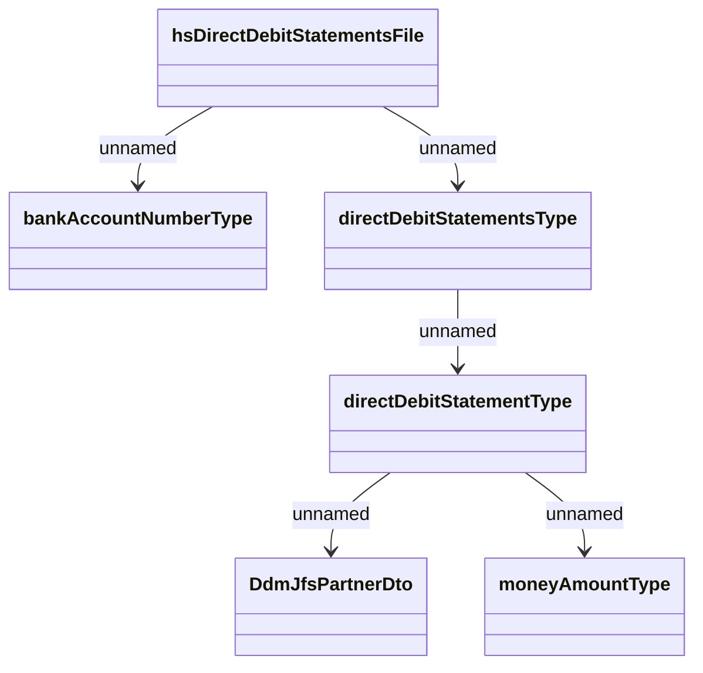

# DDS_Confirmation

```mermaid
classDiagram
    class DdmJfsPartnerDto["DdmJfsPartnerDto"]
    class moneyAmountType["moneyAmountType"]
    class bankAccountNumberType["bankAccountNumberType"]
    class directDebitStatementType["directDebitStatementType"]
    class directDebitStatementsType["directDebitStatementsType"]
    class hsDirectDebitStatementsFile["hsDirectDebitStatementsFile"]
    directDebitStatementType --> DdmJfsPartnerDto : unnamed
    hsDirectDebitStatementsFile --> directDebitStatementsType : unnamed
    directDebitStatementsType --> directDebitStatementType : unnamed
    hsDirectDebitStatementsFile --> bankAccountNumberType : unnamed
    directDebitStatementType --> moneyAmountType : unnamed
```
