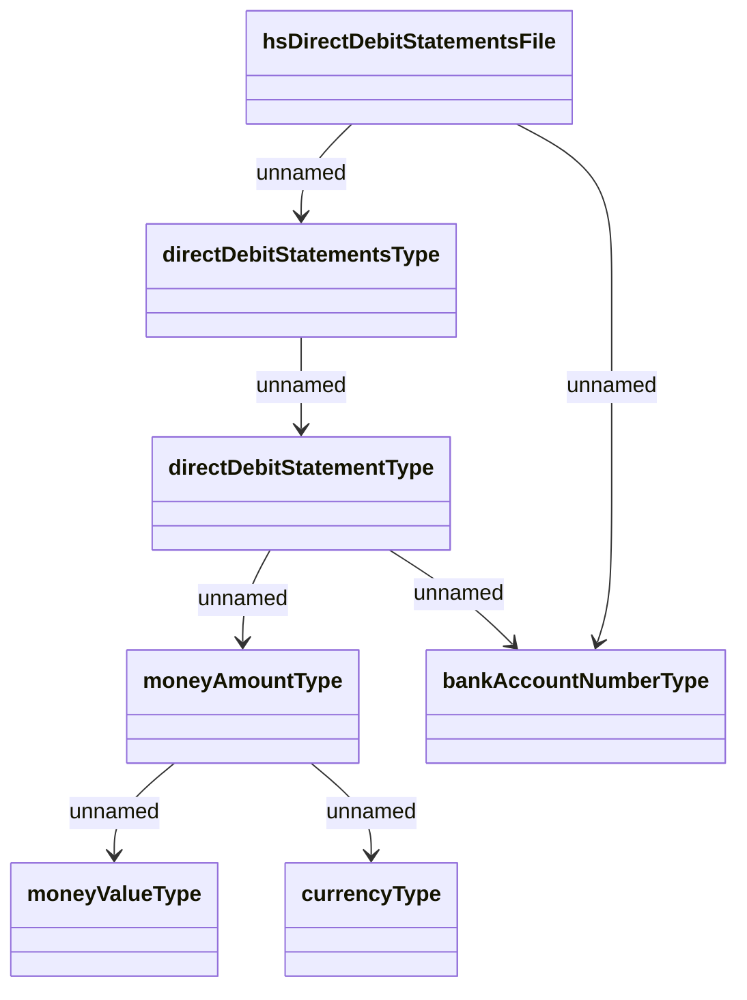

# DDS_Import

- **Diagram Type**: Logical
- **Package**: HomerSelect/BSL/Analysis Model/_Interface/Provided Web Services/Payments/PaymentsWS/DDS_Import
- **Diagram ID**: 90846
- **Elements**: 7
- **Connectors**: 7

