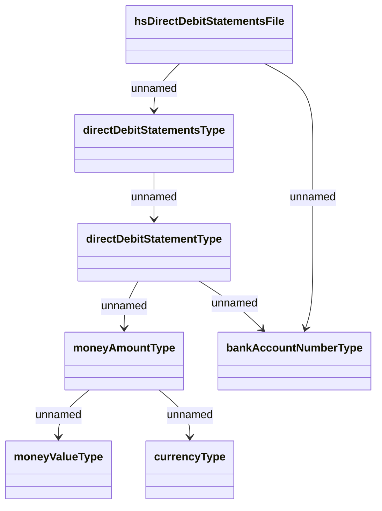

# DDS_Import

```mermaid
classDiagram
    class currencyType["currencyType"]
    class moneyValueType["moneyValueType"]
    class moneyAmountType["moneyAmountType"]
    class bankAccountNumberType["bankAccountNumberType"]
    class directDebitStatementType["directDebitStatementType"]
    class directDebitStatementsType["directDebitStatementsType"]
    class hsDirectDebitStatementsFile["hsDirectDebitStatementsFile"]
    hsDirectDebitStatementsFile --> directDebitStatementsType : unnamed
    directDebitStatementsType --> directDebitStatementType : unnamed
    directDebitStatementType --> bankAccountNumberType : unnamed
    hsDirectDebitStatementsFile --> bankAccountNumberType : unnamed
    directDebitStatementType --> moneyAmountType : unnamed
    moneyAmountType --> moneyValueType : unnamed
    moneyAmountType --> currencyType : unnamed
```
