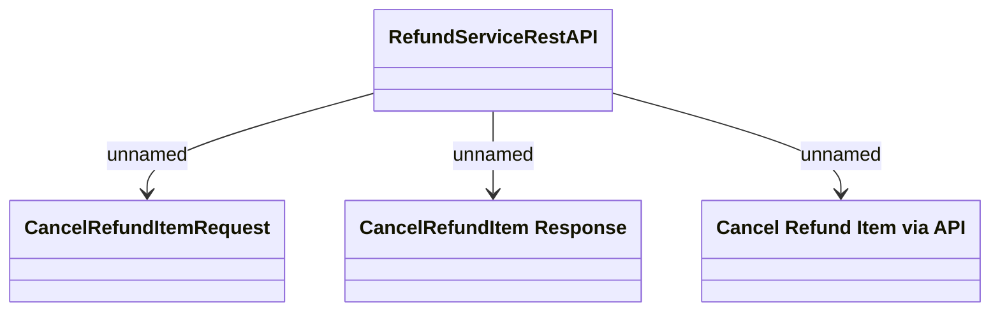

# RefundServiceRestAPI - Cancel Refund Item

```mermaid
classDiagram
    class Cancel_Refund_Item_via_API["Cancel Refund Item via API"]
    class CancelRefundItem_Response["CancelRefundItem Response"]
    class CancelRefundItemRequest["CancelRefundItemRequest"]
    class RefundServiceRestAPI["RefundServiceRestAPI"]
    RefundServiceRestAPI --> CancelRefundItemRequest : unnamed
    RefundServiceRestAPI --> CancelRefundItem_Response : unnamed
    RefundServiceRestAPI --> Cancel_Refund_Item_via_API : unnamed
```
