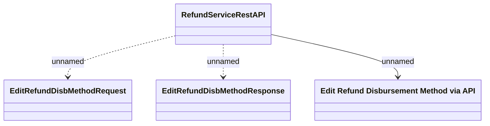

# RefundServiceRestAPI - Edit Refund Disb Method

- **Diagram Type**: Logical
- **Package**: HomerSelect/BSL/Analysis Model/_Interface/Provided Web Services/Payments/RefundServiceRestAPI/v2
- **Diagram ID**: 164304
- **Elements**: 4
- **Connectors**: 3

