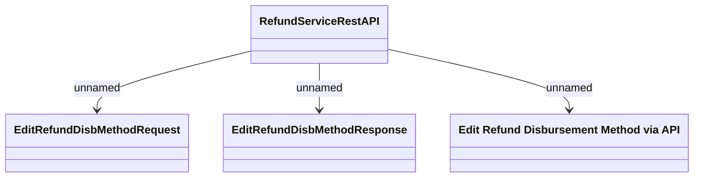

# RefundServiceRestAPI - Edit Refund Disb Method

```mermaid
classDiagram
    class Edit_Refund_Disbursement_Method_via_API["Edit Refund Disbursement Method via API"]
    class EditRefundDisbMethodResponse["EditRefundDisbMethodResponse"]
    class EditRefundDisbMethodRequest["EditRefundDisbMethodRequest"]
    class RefundServiceRestAPI["RefundServiceRestAPI"]
    RefundServiceRestAPI --> EditRefundDisbMethodRequest : unnamed
    RefundServiceRestAPI --> EditRefundDisbMethodResponse : unnamed
    RefundServiceRestAPI --> Edit_Refund_Disbursement_Method_via_API : unnamed
```
