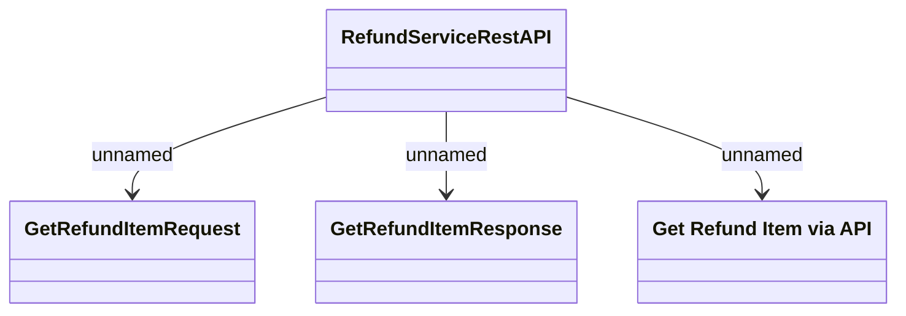

# RefundServiceRestAPI - Get Refund Item

```mermaid
classDiagram
    class Get_Refund_Item_via_API["Get Refund Item via API"]
    class GetRefundItemResponse["GetRefundItemResponse"]
    class GetRefundItemRequest["GetRefundItemRequest"]
    class RefundServiceRestAPI["RefundServiceRestAPI"]
    RefundServiceRestAPI --> GetRefundItemRequest : unnamed
    RefundServiceRestAPI --> GetRefundItemResponse : unnamed
    RefundServiceRestAPI --> Get_Refund_Item_via_API : unnamed
```
