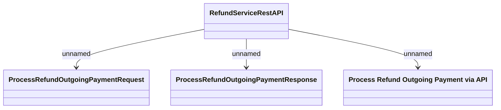

# RefundServiceRestAPI - Process Refund Outgoing Payment

```mermaid
classDiagram
    class Process_Refund_Outgoing_Payment_via_API["Process Refund Outgoing Payment via API"]
    class ProcessRefundOutgoingPaymentResponse["ProcessRefundOutgoingPaymentResponse"]
    class ProcessRefundOutgoingPaymentRequest["ProcessRefundOutgoingPaymentRequest"]
    class RefundServiceRestAPI["RefundServiceRestAPI"]
    RefundServiceRestAPI --> ProcessRefundOutgoingPaymentRequest : unnamed
    RefundServiceRestAPI --> ProcessRefundOutgoingPaymentResponse : unnamed
    RefundServiceRestAPI --> Process_Refund_Outgoing_Payment_via_API : unnamed
```
