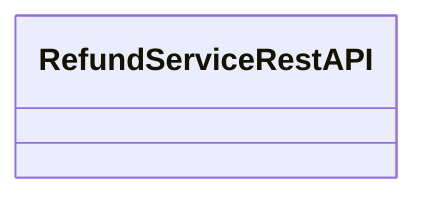

# RefundServiceRestAPI

- **Diagram Type**: Logical
- **Package**: HomerSelect/BSL/Analysis Model/_Interface/Provided Web Services/Payments/RefundServiceRestAPI/v2
- **Diagram ID**: 164303
- **Elements**: 1
- **Connectors**: 0

