# CustomerOfferWS

- **Diagram Type**: Logical
- **Package**: HomerSelect/BSL/Analysis Model/_Interface/Provided Web Services/Product Catalog/Product Calculator
- **Diagram ID**: 157931
- **Elements**: 6
- **Connectors**: 5

```mermaid
classDiagram
    class GetProductsForCommodityFinancing_CustomerOfferWS_GetProducts["GetProductsForCommodityFinancing :CustomerOfferWS - GetProductsForCommodity"]
    class GetCodeList_CustomerOfferWS_GetCodeList["GetCodeList : CustomerOfferWS - GetCodeList"]
    class GetCustomerOffer_CustomerOfferWS_GetCustomerOffer["GetCustomerOffer : CustomerOfferWS - GetCustomerOffer"]
    class RecalculateCustomerOffer_CustomerOfferWS_RecalculateCustomer["RecalculateCustomerOffer : CustomerOfferWS - RecalculateCustomerOffer"]
    class CalculateCustomerOffer_CustomerOfferWS_CalculateCustomerOffe["CalculateCustomerOffer : CustomerOfferWS - CalculateCustomerOffer"]
    class DEL_CustomerOfferWS["{DEL}CustomerOfferWS"]
    DEL_CustomerOfferWS --> CalculateCustomerOffer_CustomerOfferWS_CalculateCustomerOffe : unnamed
    DEL_CustomerOfferWS --> RecalculateCustomerOffer_CustomerOfferWS_RecalculateCustomer : unnamed
    DEL_CustomerOfferWS --> GetCustomerOffer_CustomerOfferWS_GetCustomerOffer : unnamed
    DEL_CustomerOfferWS --> GetCodeList_CustomerOfferWS_GetCodeList : unnamed
    DEL_CustomerOfferWS --> GetProductsForCommodityFinancing_CustomerOfferWS_GetProducts : unnamed
```

