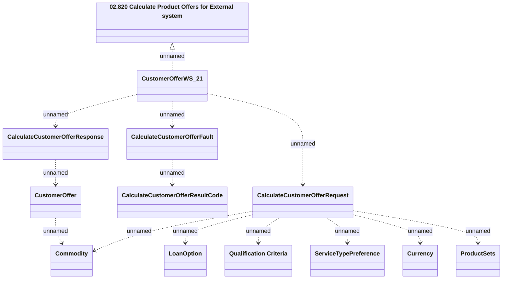

# CustomerOfferWS_v21 - CalculateCustomerOffer

- **Diagram Type**: Logical
- **Package**: HomerSelect/BSL/Analysis Model/_Interface/Provided Web Services/Product Catalog/Product Calculator/CustomerOfferWS_v21
- **Diagram ID**: 157933
- **Elements**: 13
- **Connectors**: 13

