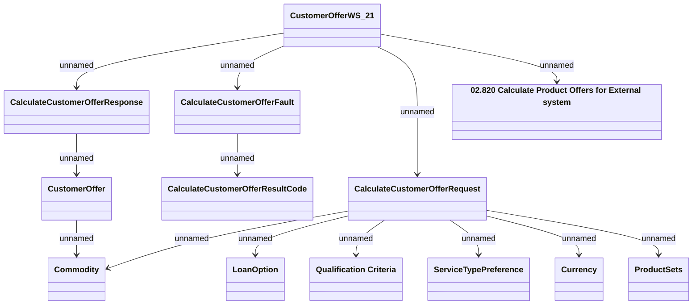

# CustomerOfferWS_v21 - CalculateCustomerOffer

```mermaid
classDiagram
    class ProductSets["ProductSets"]
    class n_02_820_Calculate_Product_Offers_for_External_system["02.820 Calculate Product Offers for External system"]
    class Currency["Currency"]
    class ServiceTypePreference["ServiceTypePreference"]
    class Qualification_Criteria["Qualification Criteria"]
    class LoanOption["LoanOption"]
    class Commodity["Commodity"]
    class CalculateCustomerOfferResultCode["CalculateCustomerOfferResultCode"]
    class CustomerOffer["CustomerOffer"]
    class CalculateCustomerOfferRequest["CalculateCustomerOfferRequest"]
    class CalculateCustomerOfferFault["CalculateCustomerOfferFault"]
    class CalculateCustomerOfferResponse["CalculateCustomerOfferResponse"]
    class CustomerOfferWS_21["CustomerOfferWS_21"]
    CustomerOfferWS_21 --> CalculateCustomerOfferResponse : unnamed
    CustomerOfferWS_21 --> CalculateCustomerOfferFault : unnamed
    CustomerOfferWS_21 --> CalculateCustomerOfferRequest : unnamed
    CalculateCustomerOfferResponse --> CustomerOffer : unnamed
    CalculateCustomerOfferFault --> CalculateCustomerOfferResultCode : unnamed
    CalculateCustomerOfferRequest --> Commodity : unnamed
    CustomerOffer --> Commodity : unnamed
    CalculateCustomerOfferRequest --> LoanOption : unnamed
    CalculateCustomerOfferRequest --> Qualification_Criteria : unnamed
    CalculateCustomerOfferRequest --> ServiceTypePreference : unnamed
    CalculateCustomerOfferRequest --> Currency : unnamed
    CustomerOfferWS_21 --> n_02_820_Calculate_Product_Offers_for_External_system : unnamed
    CalculateCustomerOfferRequest --> ProductSets : unnamed
```
