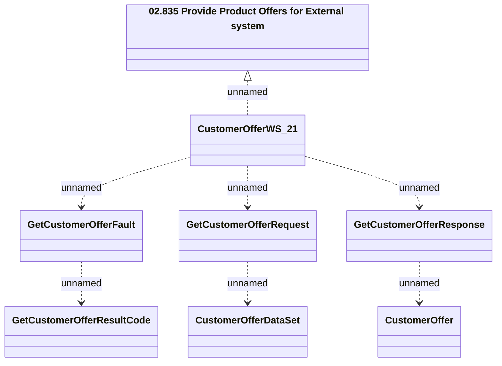

# CustomerOfferWS_v21 - GetCustomerOffer

- **Diagram Type**: Logical
- **Package**: HomerSelect/BSL/Analysis Model/_Interface/Provided Web Services/Product Catalog/Product Calculator/CustomerOfferWS_v21
- **Diagram ID**: 157935
- **Elements**: 8
- **Connectors**: 7

