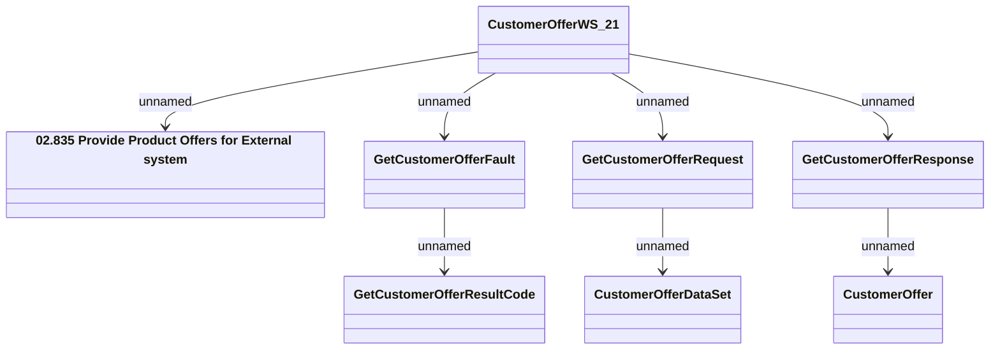

# CustomerOfferWS_v21 - GetCustomerOffer

```mermaid
classDiagram
    class CustomerOffer["CustomerOffer"]
    class CustomerOfferDataSet["CustomerOfferDataSet"]
    class n_02_835_Provide_Product_Offers_for_External_system["02.835 Provide Product Offers for External system"]
    class GetCustomerOfferResultCode["GetCustomerOfferResultCode"]
    class GetCustomerOfferResponse["GetCustomerOfferResponse"]
    class GetCustomerOfferRequest["GetCustomerOfferRequest"]
    class GetCustomerOfferFault["GetCustomerOfferFault"]
    class CustomerOfferWS_21["CustomerOfferWS_21"]
    CustomerOfferWS_21 --> GetCustomerOfferFault : unnamed
    CustomerOfferWS_21 --> GetCustomerOfferRequest : unnamed
    CustomerOfferWS_21 --> GetCustomerOfferResponse : unnamed
    GetCustomerOfferFault --> GetCustomerOfferResultCode : unnamed
    CustomerOfferWS_21 --> n_02_835_Provide_Product_Offers_for_External_system : unnamed
    GetCustomerOfferRequest --> CustomerOfferDataSet : unnamed
    GetCustomerOfferResponse --> CustomerOffer : unnamed
```
