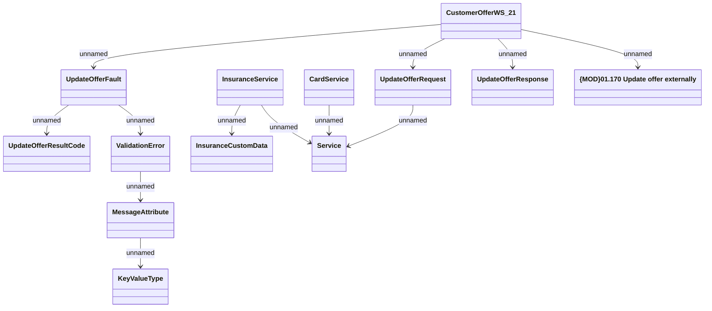

# CustomerOfferWS_v21 - UpdateOffer

```mermaid
classDiagram
    class MOD_01_170_Update_offer_externally["{MOD}01.170 Update offer externally"]
    class Service["Service"]
    class ValidationError["ValidationError"]
    class MessageAttribute["MessageAttribute"]
    class InsuranceService["InsuranceService"]
    class InsuranceCustomData["InsuranceCustomData"]
    class CardService["CardService"]
    class KeyValueType["KeyValueType"]
    class UpdateOfferResultCode["UpdateOfferResultCode"]
    class UpdateOfferResponse["UpdateOfferResponse"]
    class UpdateOfferRequest["UpdateOfferRequest"]
    class UpdateOfferFault["UpdateOfferFault"]
    class CustomerOfferWS_21["CustomerOfferWS_21"]
    CustomerOfferWS_21 --> UpdateOfferFault : unnamed
    CustomerOfferWS_21 --> UpdateOfferRequest : unnamed
    CustomerOfferWS_21 --> UpdateOfferResponse : unnamed
    UpdateOfferFault --> UpdateOfferResultCode : unnamed
    MessageAttribute --> KeyValueType : unnamed
    InsuranceService --> InsuranceCustomData : unnamed
    ValidationError --> MessageAttribute : unnamed
    UpdateOfferFault --> ValidationError : unnamed
    InsuranceService --> Service : unnamed
    CardService --> Service : unnamed
    UpdateOfferRequest --> Service : unnamed
    CustomerOfferWS_21 --> MOD_01_170_Update_offer_externally : unnamed
```
