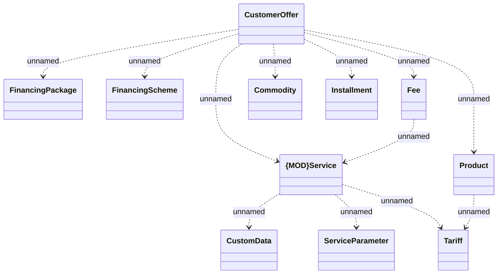

# CustomerOffer - common

- **Diagram Type**: Logical
- **Package**: HomerSelect/BSL/Analysis Model/_Interface/Provided Web Services/Product Catalog/Product Calculator/CustomerOfferWS_v21/CustomerOffer - common
- **Diagram ID**: 157937
- **Elements**: 11
- **Connectors**: 12

