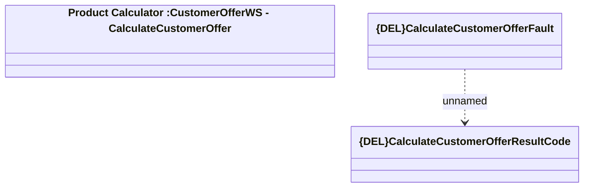

# CalculateCustomerOfferFault

- **Diagram Type**: Logical
- **Package**: HomerSelect/BSL/Analysis Model/_Interface/Provided Web Services/Product Catalog/Product Calculator/{DEL}CalculateCustomerOffer
- **Diagram ID**: 157928
- **Elements**: 3
- **Connectors**: 1

