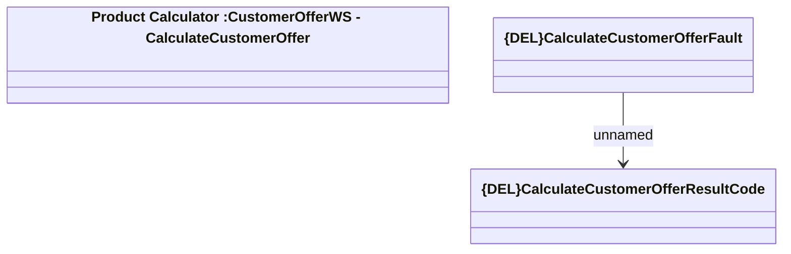

# CalculateCustomerOfferFault

```mermaid
classDiagram
    class Product_Calculator_CustomerOfferWS_CalculateCustomerOffer["Product Calculator :CustomerOfferWS - CalculateCustomerOffer"]
    class DEL_CalculateCustomerOfferResultCode["{DEL}CalculateCustomerOfferResultCode"]
    class DEL_CalculateCustomerOfferFault["{DEL}CalculateCustomerOfferFault"]
    DEL_CalculateCustomerOfferFault --> DEL_CalculateCustomerOfferResultCode : unnamed
```
