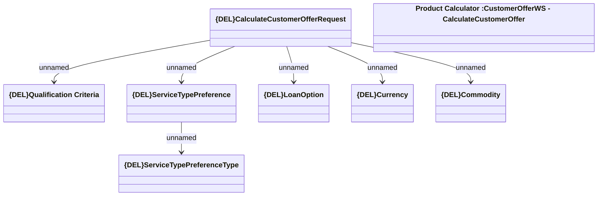

# CalculateCustomerOfferRequest

```mermaid
classDiagram
    class DEL_Qualification_Criteria["{DEL}Qualification Criteria"]
    class DEL_ServiceTypePreference["{DEL}ServiceTypePreference"]
    class DEL_ServiceTypePreferenceType["{DEL}ServiceTypePreferenceType"]
    class DEL_LoanOption["{DEL}LoanOption"]
    class DEL_Currency["{DEL}Currency"]
    class DEL_Commodity["{DEL}Commodity"]
    class DEL_CalculateCustomerOfferRequest["{DEL}CalculateCustomerOfferRequest"]
    class Product_Calculator_CustomerOfferWS_CalculateCustomerOffer["Product Calculator :CustomerOfferWS - CalculateCustomerOffer"]
    DEL_CalculateCustomerOfferRequest --> DEL_Commodity : unnamed
    DEL_CalculateCustomerOfferRequest --> DEL_Currency : unnamed
    DEL_CalculateCustomerOfferRequest --> DEL_LoanOption : unnamed
    DEL_ServiceTypePreference --> DEL_ServiceTypePreferenceType : unnamed
    DEL_CalculateCustomerOfferRequest --> DEL_ServiceTypePreference : unnamed
    DEL_CalculateCustomerOfferRequest --> DEL_Qualification_Criteria : unnamed
```
