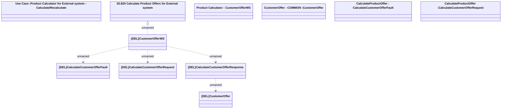

# CustomerOfferWS - CalculateCustomerOffer

- **Diagram Type**: Logical
- **Package**: HomerSelect/BSL/Analysis Model/_Interface/Provided Web Services/Product Catalog/Product Calculator/{DEL}CalculateCustomerOffer
- **Diagram ID**: 157929
- **Elements**: 11
- **Connectors**: 5

