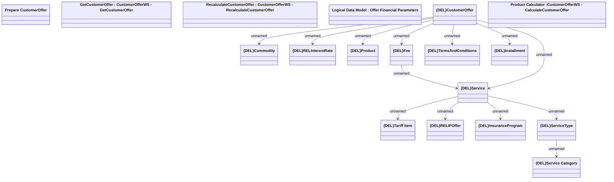

# CustomerOffer

```mermaid
classDiagram
    class DEL_Tariff_Item["{DEL}Tariff Item"]
    class DEL_Commodity["{DEL}Commodity"]
    class Prepare_CustomerOffer["Prepare CustomerOffer"]
    class GetCustomerOffer_CustomerOfferWS_GetCustomerOffer["GetCustomerOffer : CustomerOfferWS - GetCustomerOffer"]
    class RecalculateCustomerOffer_CustomerOfferWS_RecalculateCustomer["RecalculateCustomerOffer : CustomerOfferWS - RecalculateCustomerOffer"]
    class DEL_RELIPOffer["{DEL}RELIPOffer"]
    class DEL_RELInterestRate["{DEL}RELInterestRate"]
    class DEL_InsuranceProgram["{DEL}InsuranceProgram"]
    class DEL_Service_Category["{DEL}Service Category"]
    class Logical_Data_Model_Offer_Financial_Parameters["Logical Data Model : Offer Financial Parameters"]
    class DEL_ServiceType["{DEL}ServiceType"]
    class DEL_Product["{DEL}Product"]
    class DEL_Service["{DEL}Service"]
    class DEL_Fee["{DEL}Fee"]
    class DEL_TermsAndConditions["{DEL}TermsAndConditions"]
    class DEL_Installment["{DEL}Installment"]
    class DEL_CustomerOffer["{DEL}CustomerOffer"]
    class Product_Calculator_CustomerOfferWS_CalculateCustomerOffer["Product Calculator :CustomerOfferWS - CalculateCustomerOffer"]
    DEL_CustomerOffer --> DEL_Installment : unnamed
    DEL_CustomerOffer --> DEL_TermsAndConditions : unnamed
    DEL_CustomerOffer --> DEL_Fee : unnamed
    DEL_Fee --> DEL_Service : unnamed
    DEL_CustomerOffer --> DEL_Service : unnamed
    DEL_CustomerOffer --> DEL_Product : unnamed
    DEL_Service --> DEL_ServiceType : unnamed
    DEL_ServiceType --> DEL_Service_Category : unnamed
    DEL_Service --> DEL_InsuranceProgram : unnamed
    DEL_CustomerOffer --> DEL_RELInterestRate : unnamed
    DEL_Service --> DEL_RELIPOffer : unnamed
    DEL_CustomerOffer --> DEL_Commodity : unnamed
    DEL_Service --> DEL_Tariff_Item : unnamed
```
