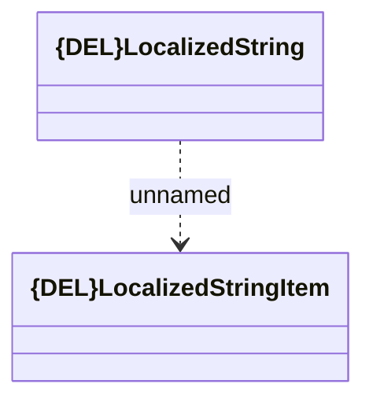

# Localized String

- **Diagram Type**: Logical
- **Package**: HomerSelect/BSL/Analysis Model/_Interface/Provided Web Services/Product Catalog/Product Calculator/{DEL}CustomerOffer - COMMON
- **Diagram ID**: 157926
- **Elements**: 2
- **Connectors**: 1

