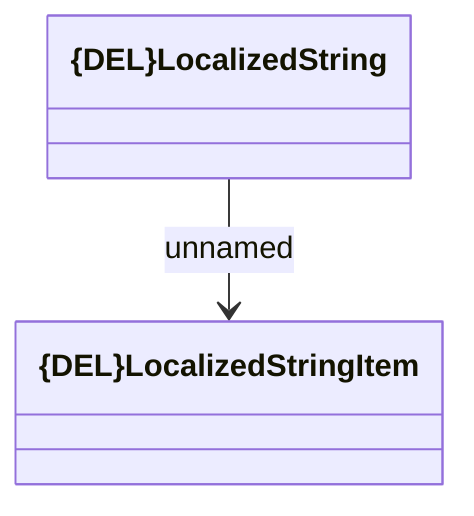

# Localized String

```mermaid
classDiagram
    class DEL_LocalizedStringItem["{DEL}LocalizedStringItem"]
    class DEL_LocalizedString["{DEL}LocalizedString"]
    DEL_LocalizedString --> DEL_LocalizedStringItem : unnamed
```
