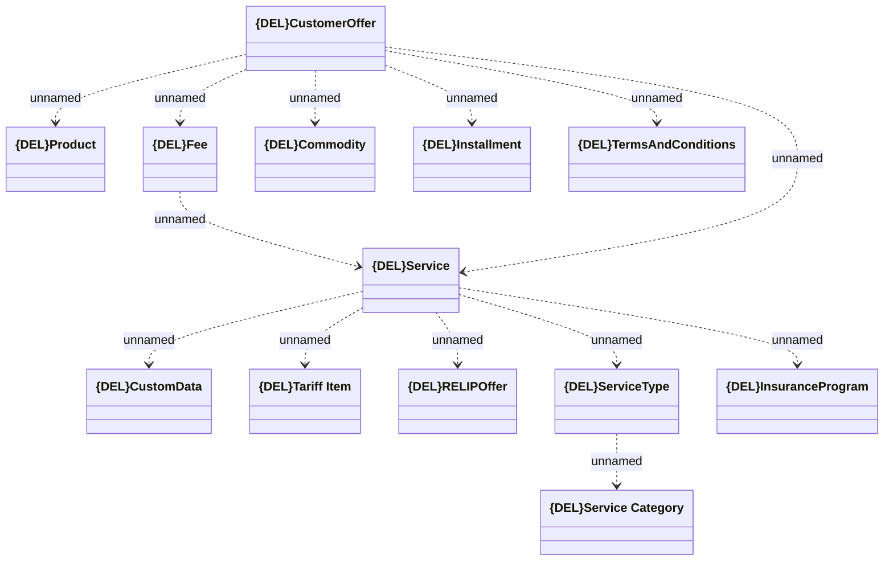

# CustomerOffer - common

- **Diagram Type**: Logical
- **Package**: HomerSelect/BSL/Analysis Model/_Interface/Provided Web Services/Product Catalog/Product Calculator/{DEL}CustomerOfferWS_v20/CustomerOffer - common
- **Diagram ID**: 157789
- **Elements**: 13
- **Connectors**: 13

