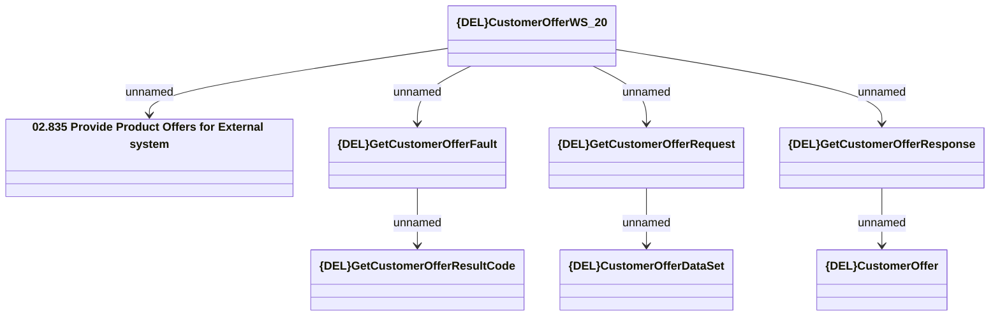

# CustomerOfferWS_v20 - GetCustomerOffer

```mermaid
classDiagram
    class DEL_CustomerOfferDataSet["{DEL}CustomerOfferDataSet"]
    class n_02_835_Provide_Product_Offers_for_External_system["02.835 Provide Product Offers for External system"]
    class DEL_GetCustomerOfferResultCode["{DEL}GetCustomerOfferResultCode"]
    class DEL_CustomerOffer["{DEL}CustomerOffer"]
    class DEL_GetCustomerOfferResponse["{DEL}GetCustomerOfferResponse"]
    class DEL_GetCustomerOfferRequest["{DEL}GetCustomerOfferRequest"]
    class DEL_GetCustomerOfferFault["{DEL}GetCustomerOfferFault"]
    class DEL_CustomerOfferWS_20["{DEL}CustomerOfferWS_20"]
    DEL_CustomerOfferWS_20 --> DEL_GetCustomerOfferFault : unnamed
    DEL_CustomerOfferWS_20 --> DEL_GetCustomerOfferRequest : unnamed
    DEL_CustomerOfferWS_20 --> DEL_GetCustomerOfferResponse : unnamed
    DEL_GetCustomerOfferResponse --> DEL_CustomerOffer : unnamed
    DEL_GetCustomerOfferFault --> DEL_GetCustomerOfferResultCode : unnamed
    DEL_CustomerOfferWS_20 --> n_02_835_Provide_Product_Offers_for_External_system : unnamed
    DEL_GetCustomerOfferRequest --> DEL_CustomerOfferDataSet : unnamed
```
