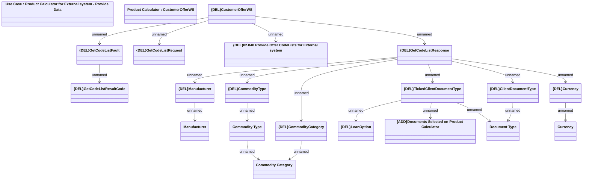

# CustomerOfferWS - GetCodeList

```mermaid
classDiagram
    class DEL_GetCodeListResultCode["{DEL}GetCodeListResultCode"]
    class DEL_GetCodeListFault["{DEL}GetCodeListFault"]
    class Use_Case_Product_Calculator_for_External_system_Provide_Data["Use Case : Product Calculator for External system - Provide Data"]
    class Manufacturer["Manufacturer"]
    class DEL_CommodityCategory["{DEL}CommodityCategory"]
    class DEL_Manufacturer["{DEL}Manufacturer"]
    class Commodity_Category["Commodity Category"]
    class Commodity_Type["Commodity Type"]
    class DEL_CommodityType["{DEL}CommodityType"]
    class DEL_LoanOption["{DEL}LoanOption"]
    class DEL_TickedClientDocumentType["{DEL}TickedClientDocumentType"]
    class ADD_Documents_Selected_on_Product_Calculator["{ADD}Documents Selected on Product Calculator"]
    class DEL_GetCodeListRequest["{DEL}GetCodeListRequest"]
    class Document_Type["Document Type"]
    class DEL_ClientDocumentType["{DEL}ClientDocumentType"]
    class Currency["Currency"]
    class DEL_02_840_Provide_Offer_CodeLists_for_External_system["{DEL}02.840 Provide Offer CodeLists for External system"]
    class DEL_Currency["{DEL}Currency"]
    class DEL_GetCodeListResponse["{DEL}GetCodeListResponse"]
    class Product_Calculator_CustomerOfferWS["Product Calculator : CustomerOfferWS"]
    class DEL_CustomerOfferWS["{DEL}CustomerOfferWS"]
    DEL_ClientDocumentType --> Document_Type : unnamed
    DEL_GetCodeListResponse --> DEL_ClientDocumentType : unnamed
    DEL_Currency --> Currency : unnamed
    DEL_GetCodeListResponse --> DEL_Currency : unnamed
    DEL_GetCodeListResponse --> DEL_CommodityType : unnamed
    DEL_GetCodeListResponse --> DEL_TickedClientDocumentType : unnamed
    DEL_Manufacturer --> Manufacturer : unnamed
    DEL_GetCodeListResponse --> DEL_CommodityCategory : unnamed
    DEL_GetCodeListResponse --> DEL_Manufacturer : unnamed
    DEL_CommodityCategory --> Commodity_Category : unnamed
    Commodity_Type --> Commodity_Category : unnamed
    DEL_CommodityType --> Commodity_Type : unnamed
    DEL_GetCodeListFault --> DEL_GetCodeListResultCode : unnamed
    DEL_TickedClientDocumentType --> DEL_LoanOption : unnamed
    DEL_TickedClientDocumentType --> ADD_Documents_Selected_on_Product_Calculator : unnamed
    DEL_TickedClientDocumentType --> Document_Type : unnamed
    DEL_CustomerOfferWS --> DEL_02_840_Provide_Offer_CodeLists_for_External_system : unnamed
    DEL_CustomerOfferWS --> DEL_GetCodeListFault : unnamed
    DEL_CustomerOfferWS --> DEL_GetCodeListResponse : unnamed
    DEL_CustomerOfferWS --> DEL_GetCodeListRequest : unnamed
```
