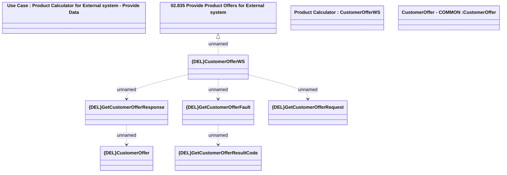

# CustomerOfferWS - GetCustomerOffer

- **Diagram Type**: Logical
- **Package**: HomerSelect/BSL/Analysis Model/_Interface/Provided Web Services/Product Catalog/Product Calculator/{DEL}GetCustomerOffer
- **Diagram ID**: 157920
- **Elements**: 10
- **Connectors**: 6

