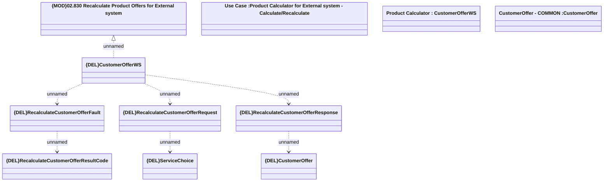

# CustomerOfferWS - RecalculateCustomerOffer

- **Diagram Type**: Logical
- **Package**: HomerSelect/BSL/Analysis Model/_Interface/Provided Web Services/Product Catalog/Product Calculator/{DEL}RecalculateCustomerOffer
- **Diagram ID**: 157924
- **Elements**: 11
- **Connectors**: 7

