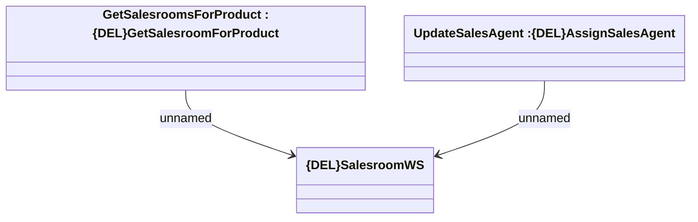

# {DEL}SalesroomWS

```mermaid
classDiagram
    class GetSalesroomsForProduct_DEL_GetSalesroomForProduct["GetSalesroomsForProduct :{DEL}GetSalesroomForProduct"]
    class UpdateSalesAgent_DEL_AssignSalesAgent["UpdateSalesAgent :{DEL}AssignSalesAgent"]
    class DEL_SalesroomWS["{DEL}SalesroomWS"]
    GetSalesroomsForProduct_DEL_GetSalesroomForProduct --> DEL_SalesroomWS : unnamed
    UpdateSalesAgent_DEL_AssignSalesAgent --> DEL_SalesroomWS : unnamed
```
