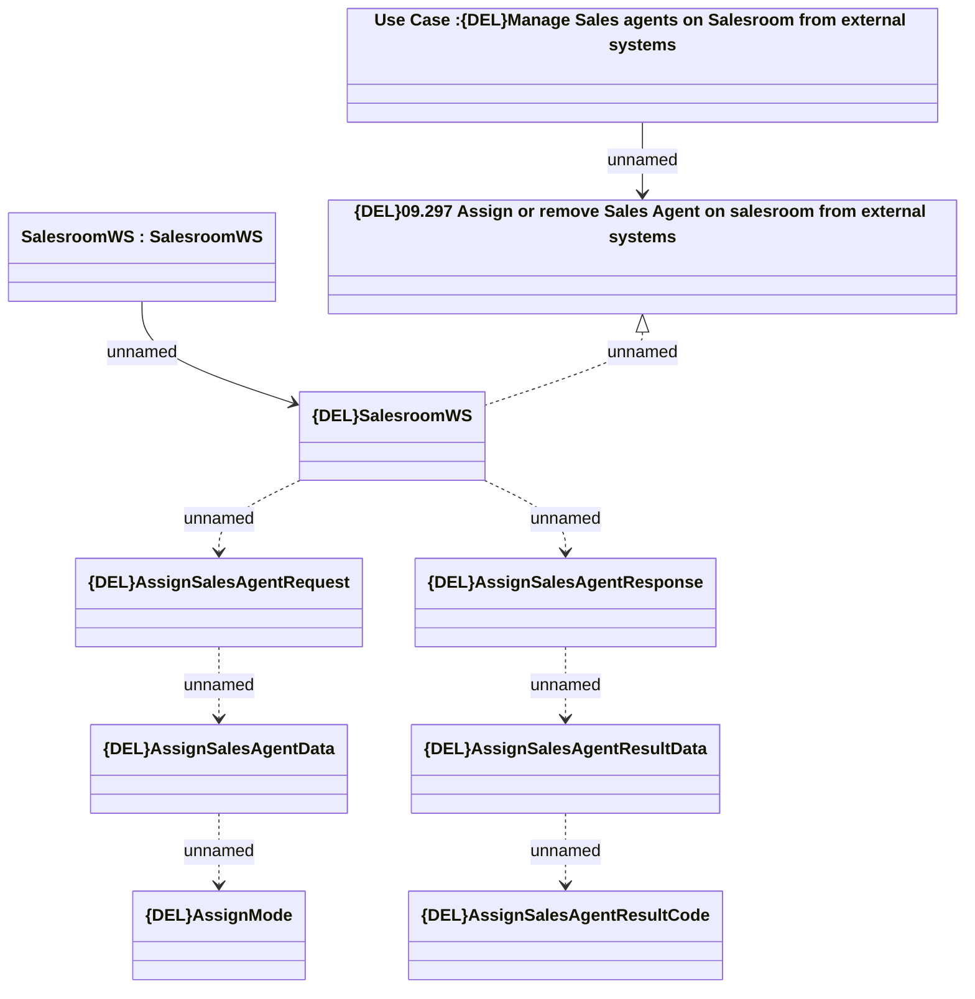

# AssignSalesAgent

- **Diagram Type**: Logical
- **Package**: HomerSelect/BSL/Analysis Model/_Interface/Provided Web Services/Sales Network Management/{DEL}SalesroomWS/{DEL}AssignSalesAgent
- **Diagram ID**: 150984
- **Elements**: 10
- **Connectors**: 9

