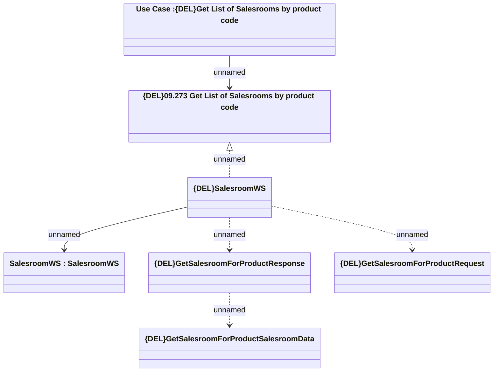

# {DEL}GetSalesroomForProduct

- **Diagram Type**: Logical
- **Package**: HomerSelect/BSL/Analysis Model/_Interface/Provided Web Services/Sales Network Management/{DEL}SalesroomWS/{DEL}GetSalesroomForProduct
- **Diagram ID**: 150987
- **Elements**: 7
- **Connectors**: 6

