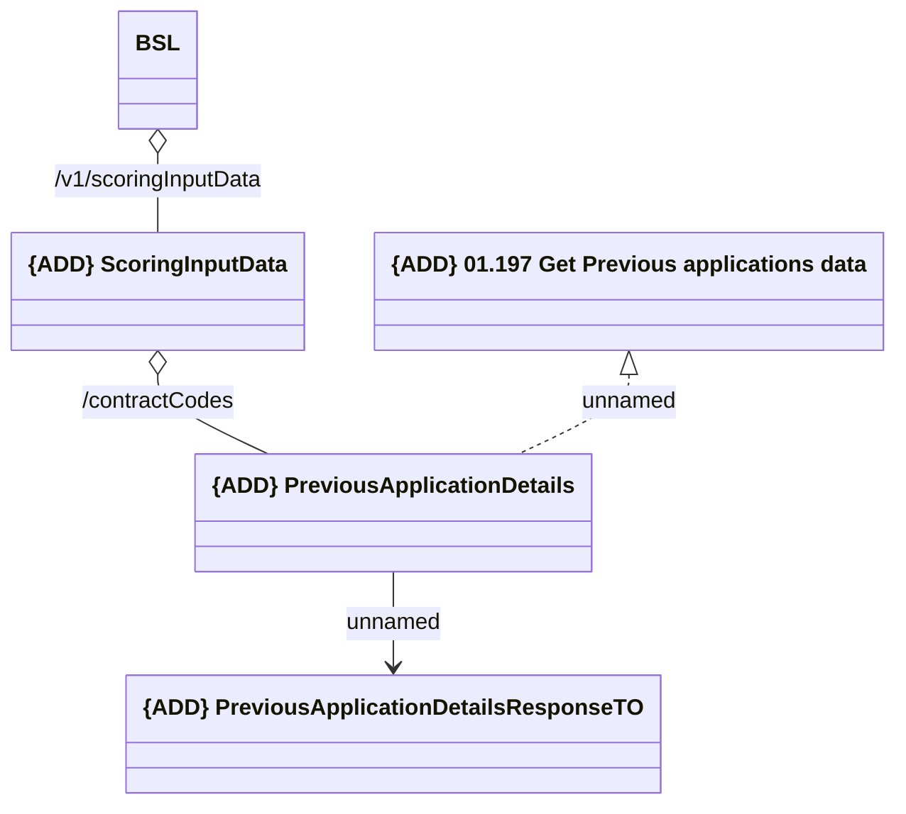

# RestAPI

- **Diagram Type**: Logical
- **Package**: HomerSelect/BSL/Analysis Model/_Interface/Provided Web Services/Scoring Input Data/RestAPI
- **Diagram ID**: 155802
- **Elements**: 5
- **Connectors**: 4

