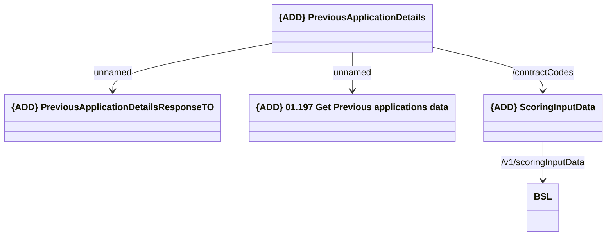

# RestAPI

```mermaid
classDiagram
    class ADD_PreviousApplicationDetailsResponseTO["{ADD} PreviousApplicationDetailsResponseTO"]
    class BSL["BSL"]
    class ADD_01_197_Get_Previous_applications_data["{ADD} 01.197 Get Previous applications data"]
    class ADD_PreviousApplicationDetails["{ADD} PreviousApplicationDetails"]
    class ADD_ScoringInputData["{ADD} ScoringInputData"]
    ADD_PreviousApplicationDetails --> ADD_ScoringInputData : /contractCodes
    ADD_PreviousApplicationDetails --> ADD_01_197_Get_Previous_applications_data : unnamed
    ADD_PreviousApplicationDetails --> ADD_PreviousApplicationDetailsResponseTO : unnamed
    ADD_ScoringInputData --> BSL : /v1/scoringInputData
```
