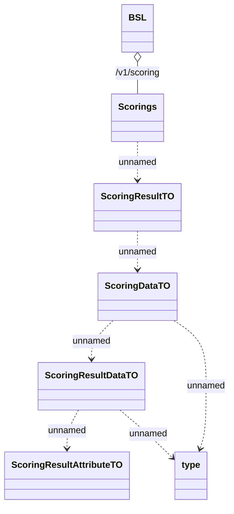

# Scoring data

- **Diagram Type**: Logical
- **Package**: HomerSelect/BSL/Analysis Model/_Interface/Provided Web Services/Scoring/Rest
- **Diagram ID**: 155867
- **Elements**: 8
- **Connectors**: 7

