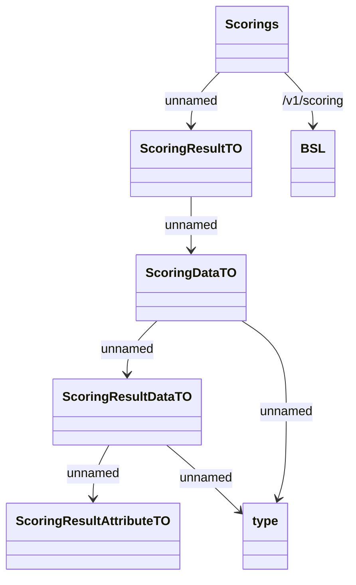

# Scoring data

```mermaid
classDiagram
    class type["type"]
    class ScoringResultAttributeTO["ScoringResultAttributeTO"]
    class ScoringResultDataTO["ScoringResultDataTO"]
    class type["type"]
    class ScoringResultTO["ScoringResultTO"]
    class ScoringDataTO["ScoringDataTO"]
    class Scorings["Scorings"]
    class BSL["BSL"]
    ScoringResultDataTO --> ScoringResultAttributeTO : unnamed
    ScoringResultDataTO --> type : unnamed
    ScoringResultTO --> ScoringDataTO : unnamed
    ScoringDataTO --> ScoringResultDataTO : unnamed
    ScoringDataTO --> type : unnamed
    Scorings --> ScoringResultTO : unnamed
    Scorings --> BSL : /v1/scoring
```
