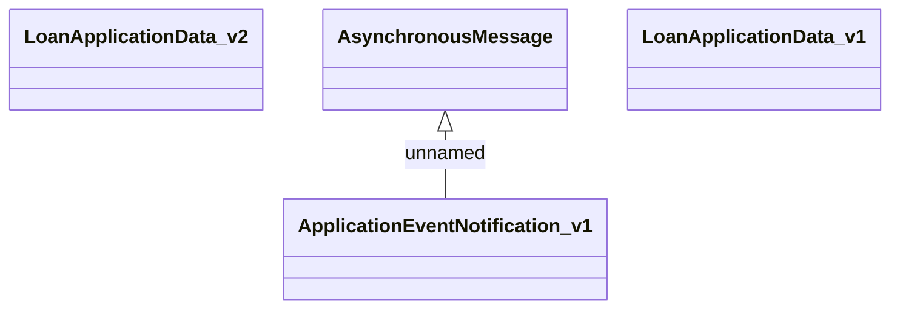

# Asynchronous Message

- **Diagram Type**: Logical
- **Package**: HomerSelect/BSL/Analysis Model/_Interface/Provided notification messages/Asynchronous Message
- **Diagram ID**: 130266
- **Elements**: 4
- **Connectors**: 1

