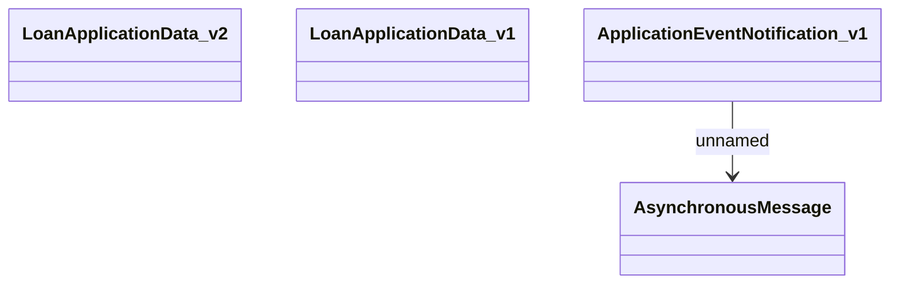

# Asynchronous Message

```mermaid
classDiagram
    class LoanApplicationData_v2["LoanApplicationData_v2"]
    class AsynchronousMessage["AsynchronousMessage"]
    class LoanApplicationData_v1["LoanApplicationData_v1"]
    class ApplicationEventNotification_v1["ApplicationEventNotification_v1"]
    ApplicationEventNotification_v1 --> AsynchronousMessage : unnamed
```
