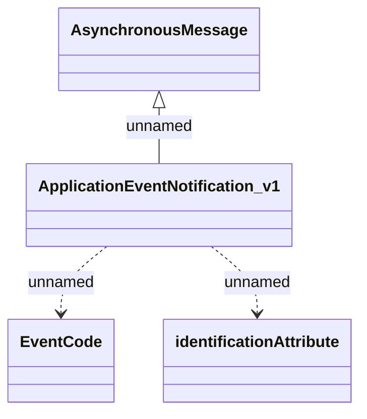

# ApplicationEventNotification_v1

- **Diagram Type**: Logical
- **Package**: HomerSelect/BSL/Analysis Model/_Interface/Provided notification messages/Asynchronous Message/Application Event/ApplicationEventNotification_v1
- **Diagram ID**: 132800
- **Elements**: 4
- **Connectors**: 3

